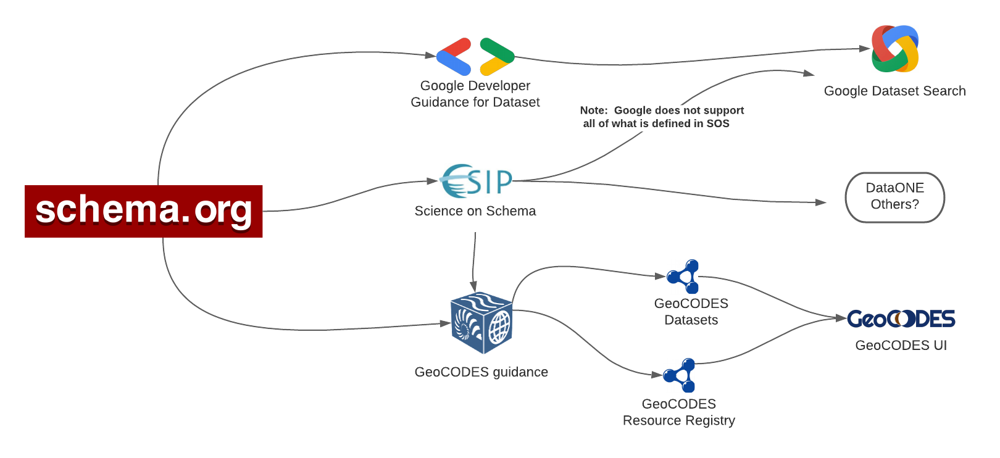

# ECO GeoCODES Profile

This document will evolve to provide guidance to groups on how to address elements of their metadata policy and procedures to address indexing by GeoCODES.  To provide some context we can look at other activities and see their relationships.   

*   Google Dev Guidance helps guide use in _Google Dataset Search_
*   ESIP Science on Schema guides use of _Type_ Dataset ([https://schema.org/Dataset](https://schema.org/Dataset)) 
*   EarthCube GeoCODES provides guidance on the _application_ GeoCODES search

An element of this is the leveraging of the graph to provide connections to other resources.  In particular the resources in the EarthCube Resource Registry graph.  However, links to other external resources like the EarthCube Throughput project are being developed. 

This work will be done in a way that can be applied to other groups (present and future) as well.  

An example of the current approach for linking to the Resource Registry follows.  This is evolving at present as we explore how to connect this through to the user interface. 

GeoCODES team will work to refine and publish this guidance along with machine workflows to validate JSON-LD data graphs with.  Likely via SHACL shape graphs.  

## Preview of these recommendations include:

### On the server side:

The following are items of use to the GeoCODES harvest and indexing process.  

Sitemap or Sitemap index

You can leverage a sitemap (up to 50K resources) or a sitemap index to go beyond that.  An index will point to multiple sitemaps.  Note, you can use the index pattern to point to different resource types too.  For example, a sitemap index can point to various sitemaps for tools/software, people, dataset, etc.  This is also completely compatible with Google and other commercial site index systems.  

Leverage Sitemap with dates

Adding the dates node and updating it will be useful as we move to an automated indexing pattern with GeoCODES.   If present we will use this to guide the architecture to do faster and less burdensome indexing.   Sites that do not provide this date node will need to be periodically completely indexed to ensure updates to metadata records are found and indexed.  

Content negotiate

Though note required, we do support content negotiation for accessing your resources.  This can be both faster and less stressful on servers.  You do not need to provide any guidance back to EarthCube if you implement this.

Headless vs static

Both static and dynamic inclusion of the JSON-LD data graph into the page DOM is supported.  EarthCube (and all commercial indexes) support this "headless" rendering of pages for indexing.   At present we do not have a good standards based way to communicate this to EarthCube.  We are addressing approaches, both in the indexing code and via the web architecture to do this.   We will provide further guidance, if necessary, as it develops on this point.   Providers should feel free to select either approach as it addresses their own criteria.  

### In the graph:

The following are either important in the search UI or (in the case of variable measured) items we have talked about leveraging.   It is important to know that these are items used by the search application.  In many ways this is a subset of Science on Schema of importance to us in providing the GeoCODES search UI/UX.  

ID

When generating your JSON-LD be sure to include a top level @id that points to the metadata record of the resource you are describing.  This can be a DOI like a DataCite metadata record but it can also be the URL of the landing page hosting your JSON-LD and describing the resource.

Descriptive text

The initial search is focused mostly on text searches across the literal strings of the graph, then we conduct other graph connections as the query is processed into a set of results.   So, while it's important to publish the graph elements it is also important to provide descriptive text and keywords at every level of the JSON-LD graph.

Distribution url

Follow ESIP Science on Schema guidance here.  

Ref: [https://github.com/ESIPFed/science-on-schema.org/blob/master/guides/Dataset.md#distributions](https://github.com/ESIPFed/science-on-schema.org/blob/master/guides/Dataset.md#distributions) 

Encoding format

Follow ESIP Science on Schema guidance here.  

Ref: [https://github.com/ESIPFed/science-on-schema.org/blob/master/guides/Dataset.md#distributions](https://github.com/ESIPFed/science-on-schema.org/blob/master/guides/Dataset.md#distributions) 

Variable measured 

This is a developing area and we will implement ESIP Science on Schema recommendations here.

Spatial

Many ways to do it, but GeoCODES may propose geosparql WKT approach

